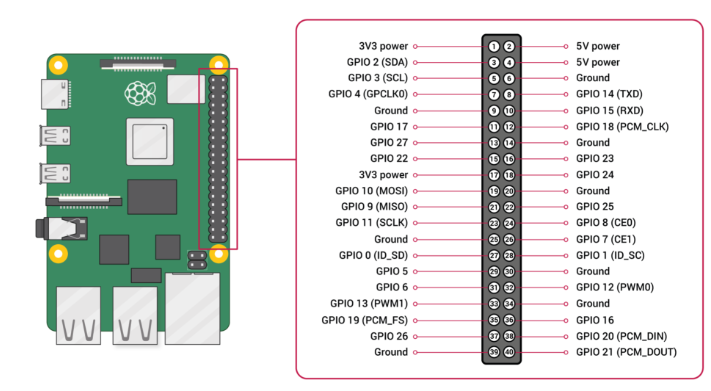

# romote-control
virtual-joystick UI and django server for remote control robot 

# Run the ws server
gunicorn --bind 0.0.0.0:8000 WS_RemoteControl.asgi --timeout 600 -w 2 -k uvicorn.workers.UvicornWorker
# Raspberry Pi GPIO Pinout

